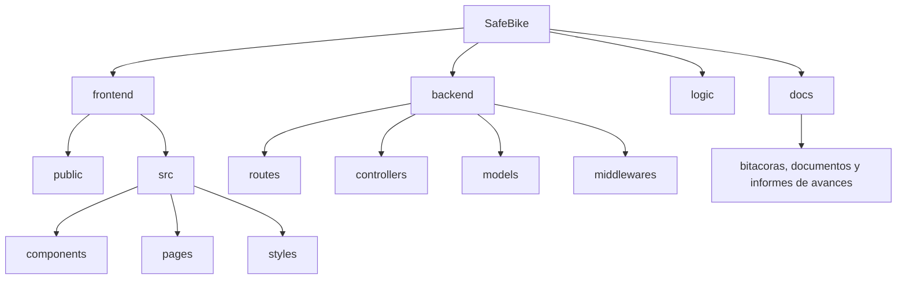

# Estructura de Carpetas del Proyecto SafeBike

Este archivo muestra de forma visual y con ejemplos qué contiene cada carpeta principal del proyecto SafeBike. Puedes usar el diagrama ASCII para una vista rápida o el diagrama Mermaid si tu visor de Markdown lo soporta.

---

## Vista rápida (árbol ASCII)

```
SafeBike/
├── README.md
├── LICENSE.md
├── index.md
├── docs/
│   ├── INFORME DEL PROYECTO.pdf
│   └── estructura_carpetas.md
├── frontend/
│   ├── public/
│   │   ├── index.html
│   │   └── favicon.ico
│   └── src/
│       ├── components/
│       │   └── Header.js
│       ├── pages/
│       │   └── Home.js
│       └── styles/
│           └── tailwind.css
├── logic/
│   └── validators.js
└── backend/
    ├── routes/
    │   └── users.routes.js
    ├── controllers/
    │   └── users.controller.js
    ├── models/
    │   └── user.model.js
    └── middlewares/
        └── auth.middleware.js
```

---

## Diagrama (Mermaid)



> Nota: Para ver el diragrama instalar la extencion mermaid

---

## Descripción detallada por carpeta

- `frontend/` — Interfaz de usuario (SPA o páginas estáticas)
  - `public/`: Archivos estáticos (ej.: `index.html`, `favicon.ico`, imágenes y assets).
    - `src/`: Código fuente (JavaScript, HTML y CSS).
      - `components/`: Componentes reutilizables (ej.: `Header.js`, `Button.js`).
      - `pages/`: Vistas completas (ej.: `Home.js`, `Login.js`, `Dashboard.js`).
    - `styles/`: Archivos de Tailwind o CSS global (`tailwind.css`, `globals.css`).

- `logic/` — Lógica de negocio compartida
  - Helpers y utilidades que pueden usarse desde `frontend` y `backend` (ej.: `validators.js`, `formatters.js`, `authUtils.js`).

- `backend/` — Servidor y API (Express)
  - `routes/`: Ruteadores que exponen endpoints (ej.: `users.routes.js`, `bikes.routes.js`).
  - `controllers/`: Controladores con la lógica por endpoint (ej.: `users.controller.js`).
  - `models/`: Esquemas de datos (ORM/ODM) o interfaces de acceso a BD (ej.: `user.model.js`).
  - `middlewares/`: Middlewares para auth, validación y logging (ej.: `auth.middleware.js`).
  - Archivos raíz típicos: `app.js`/`server.js`, `package.json`, `.env.example`.

- `docs/` — Documentación y recursos del proyecto
  - Informes (PDF), diagramas, actas de campo y documentación de diseño.

- Archivos raíz importantes
  - `README.md`: Resumen y guía del proyecto.
  - `LICENSE.md`: Licencia.
  - `index.md`: Índice del repositorio.

---

## Ejemplo rápido: archivos mínimos para arrancar

- Backend mínimo:
  - `backend/server.js` (arranque de Express)
  - `backend/routes/index.js`
  - `backend/controllers/health.controller.js`
  - `backend/models/`

- Frontend mínimo:
  - `frontend/public/index.html`
<<<<<<< HEAD
  - `frontend/src/main.js` (entry)
  - `frontend/src/pages/Home.js`
=======
  - `frontend/src/main.jsx` (entry)
  - `frontend/src/pages/Home.jsx`

---
>>>>>>> 0cdf02a65fc339da82ddb56381f891f86c1579d6
